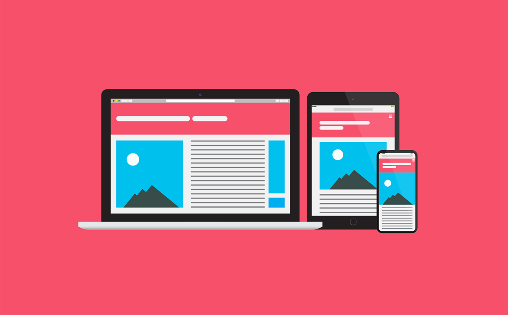

## Responsive Design 💻
Responsive design is a web design approach that ensures a website's content displays efficiently and effectively on different devices and screen sizes. It aims to provide an optimal viewing experience—easy reading and navigation with minimal resizing, panning, and scrolling—across a wide range of devices, from desktop computer monitors to mobile phones. This is achieved by using fluid grids, flexible images, and CSS media queries, allowing the layout of a website to adapt to the viewing environment. The key goal of responsive design is to build web pages that detect the visitor’s screen size and orientation and change the layout accordingly. This approach enhances user experience and accessibility, making websites functional and user-friendly on any device.

# What we should learn from this project: 📑
- Mobile-first design
- Media-queries
- Sizes to use for responsive web design
- How to make a website responsive
- The differences between responsive and adaptive design
- CSS units that are used to make elements flexible
## Authors
- [Mouayed sabbagh](https://github.com/MOUAYEDSB)